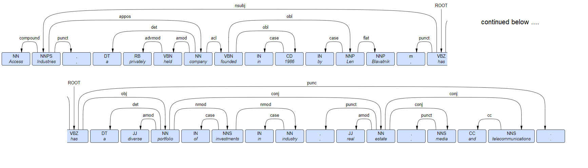
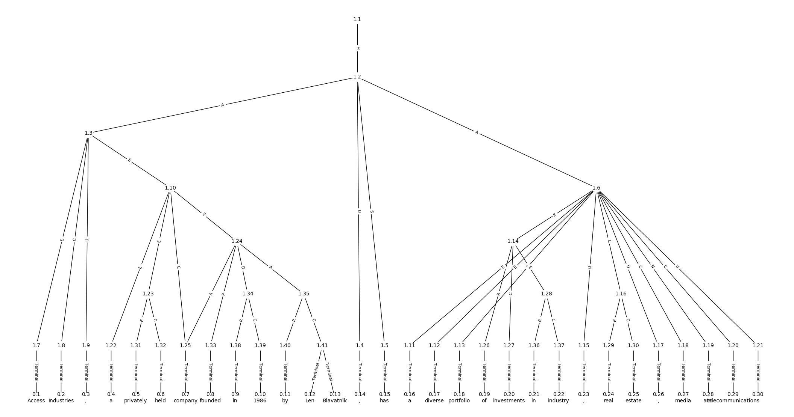
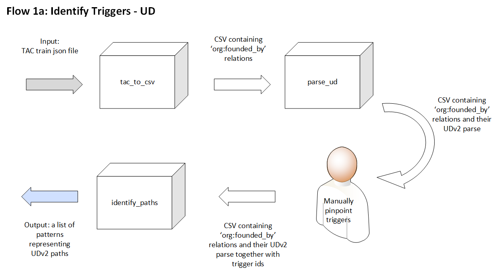
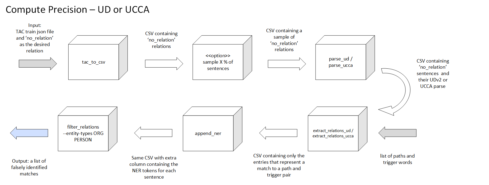
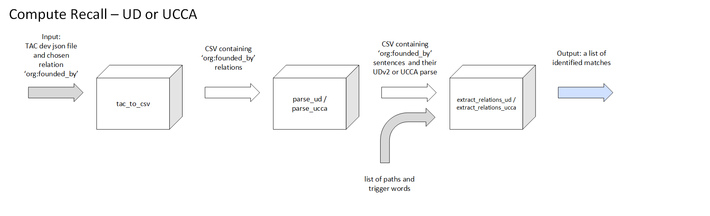

# relation-extraction-utils: <BR>Improving the results of relation extraction with syntactic based patterns by leveraging semantic based patterns (with supporting software)

## Introduction

The relation-extraction-utils project contains an assembly of Python 3 packages used by Or, Shachar and Jonathan in support of their graduate lab work at the Computational Linguistics Lab of the Hebrew University, in the field of rules based systems for relation extraction, under the guidance of [Dr. Omri Abend](http://www.cs.huji.ac.il/~oabend/).

The aim of the lab is to assess whether it is possible to improve the results of traditional pattern based approaches for identifying relations between two entities by considering patterns that stem from semantical structure of sentences, as expressed by [UCCA](http://www.cs.huji.ac.il/~oabend/ucca.htm) .

We relied on the [TAC Relation Extraction Dataset](https://catalog.ldc.upenn.edu/LDC2018T24 )  as our input. This dataset contains a total of 106,264 entries each representing a single sentences. Each entry contains identification of two entities and their TAC KBP relation, or no relation at all. Additionally, each entry contains Standford NLP based parts-of-speech tagging, NER tagging and dependency tree, however we did not utilize this data. The sentences are divided into sets of Train, Dev and Test.  

For the purpose of our study, we focused on the 'org:founded_by' relationship - with 124 appearances in the Train set and 76 appearances in the Dev set. 

## Method

We focus on relations that arise from individual sentences, and assume that the ability of a human reader or listener to infer the existence of a relationship between two entities is generally contingent on the existence of  "trigger word".  We designed and implemented a software based *pipeline* for both pattern extraction and pattern application, with the former requiring minimal human intervention, and the latter requiring no human intervention at all. 

The patterns themselves are based on the concept of a *path* between tokens in the sentence; specifically, a pattern consists of an expression of the path between the first entity and the trigger word, and then from the trigger word to the second entity. 

The heart of this project is a technique for capturing a path between tokens using a sentences dependency structures. To this end we leverage two sentence dependency structures paradigms - the syntactic UDv2 and the semantic UCCA. 

### Universal Dependencies v2 

"The UD annotation scheme produces syntactic analyses of sentences in terms of the dependencies of dependency grammar. Each dependency is characterized in terms of a syntactic function, which is shown using a label on the dependency edge." (from [Wikipedia article on Universal Dependencies](https://universaldependencies.org/)). 

Version 2 of Universal Dependencies represents an advancement of the syntactic dependencies and it is the version used in this work. At the time of writing the only freely available software package that supports the parsing of a sentence into v2 of UD that we were able to identify is [StanfordNLP: A Python NLP Library for Many Human Languages](<https://github.com/stanfordnlp/stanfordnlp>). The well known [Java based NLP library from Standford](<https://github.com/stanfordnlp/CoreNLP>) is still oriented to v1 of UD.

To explain how the paths are reflected as a pattern, we consider the sentence *"Access Industries, a privately held company founded in 1986 by Len Blavatnik, has a diverse portfolio of investments in industry, real estate, media and telecommunications"* (id: e7798385822df5ab337e, docid: APW_ENG_20090612.0855). It contains an *org:founded_by* relationship between the organization *'Access Industries'* and the person *'Len Blavatnik'*; the trigger we identified in this case is the word *'founded'*.

We consider the dependency structure of the sentence:



Entity one is *'Access Industries'*, entity two is *'Len Blavatnik'* and the trigger word us *'founded'* - the path from entity one to the trigger word (which we define to be the shortest possible path) follows this trail: from the token *'Industries'* in the direction of its *appos* dependency child, the token *'company'*, and then from the token *'company'* to its *acl* dependency child *'founded'*. We capture this path as **!appos !acl** where the '!' represents a move from parent to child; a step from child to parent would be represented with the '^' (so for example, the path from *'founded'* back to *'Industries'* would be represented with the string **^acl ^appos**). The second part of the pattern represents the path from the tojen *'founded'* to the token *'Len'*. Using the same system we get **!obl**. We capture both parts of the path by concatenating them, using the symbol **><** to represent the trigger word, yielding the full path of **!appos !acl >< !obl**.

### UCCA

While UD describes sentence structure in syntactical terms, UCCA (Universal Conceptual Cognitive Annotation) is a semantical approach to grammatical representations developed in the Computational Linguistics Lab of the Hebrew University by [Dr. Omri Abend](http://www.cs.huji.ac.il/~oabend) and [Prof. Ari Rappoport](http://www.cs.huji.ac.il/~arir).  [TUPA](<http://www.cs.huji.ac.il/~danielh/ucca/#>) is a Transition-Based UCCA Parser, also developed in the Computational Linguistics Lab of the Computer Science Department of the Hebrew University. We used a specific branch of the [Transition-based UCCA Parser](https://github.com/OfirArviv/tupa) for our work, in conjunction with the *elmo* model. 

We consider the UCCA structure of the sentence we presented above:



We need to capture the shortest path from token #0.1 *'Access'* to token #0.8 *'founded'*: starting from #0.1's parent, #1.7, against the direction of the dependency to #1.3, and then from #1.3, with the direction of the dependency, to #1.10, #1.24 and finally #1.33. We express both the type of link and the direction we flow in the path to give us **^E !E !E !P**. In the same vein, the path from the trigger word's parent #1.33 to entity two's parent is **^P !A !C**. Considering both legs of the path, and again representing the trigger word with **><**  we get the pattern **^E !E !E !P >< ^P !A !C** for the entire path.

## Pipeline

The example above considers a single sentence and expatiates on how it's paths are constructed.  Clearly we need a way for automating the process of identifying paths for a given relation, and then for extracting relations based on those paths. 

The core of this project is a software based pipeline for achieving precisely that. As input the pipeline receives a TAC Relation Extraction Dataset in json format and the name of the relation, and produces, as it's first step, a comma separated file that contains the token indices for the two entities that form the relation. The pipeline implementation borrows from the Unix *pipe* paradigm, in which the output of one utility forms the input of the next (e.g. `grep NLP text | wc -l`). As such, translating json format into a comma separated format is very practical, since it allows for simple line-by-line processing, where the first line of any csv input defines the expected fields, and all following lines contain all the information pertaining to an individual sentence. The pipeline is implemented as a conglomeration of python modules each representing a reusable step in the pipeline process.

There are two distinct phases in the pipeline operation - pattern identification and relation extraction . The sections bellow will describe the pipeline with reference to the specific relation that the project focused on - *org:founded_by* - however, the pipeline can be applied to any other TAC KBP relation.

### Pattern Identification

The following diagram demonstrates the pipeline steps required in the *identify patterns* phase, with each rectangle representing a software module and the input being the TAC Train json file. The pipeline can be run for either the UD flow (using *parse_ud*) or the UCCA flow (using *parse_ucca*)



Following the *tac_to_csv* step, either *parse_ud* or *parse_ucca* is executed to produce a csv file in which each row contains a serialization of either a UD or a UCCA dependency tree. At this point a manual step is required for identifying the index of the trigger token for each row. Finally the csv file containing the trigger index is fed to *identify_paths*, which outputs the path for each sentence. Manual manipulation of the the output file (e.g. in Excel) is needed to produce the list of unique paths. 

The entire process can be summarized as:

1. `cat dev.json | tac_to_csv --relation <relation_name> | parse_ucca > interim.csv`
2. for each row in `interim.csv` manually add the token id of the trigger word producing a `trigger.csv` file
3. `cat trigger.csv | identify_paths > paths.csv`
4. For each sentence `paths.csv` will contain it's UD or UCCA path. Manual manipulation is required to produce the list of unique UD or UCCA paths required for next steps.

### Compute Precision

The pattern identification step results in a list of paths for the given pattern, as well as a list of trigger words  that were identified manually. In order to compute precision we use sentences that are deemed in the TAC Train dataset to be of the *no_relation* relation, meaning that there is no relation between the two identified entities in the sentence. We count the number of such pairs that are falsely identified as forming an org:founded_by pair by one of the paths in our list out of the total number of sentences to produce a precision value.

The following diagram captures the precision computation sequence:



The entire process is captured in a single command line invocation:

`tac_to_csv --input train.json --relation no_relation | parse_ucca | extract_relations_ucca paths triggers | append_ner | filiter_relations --entity-types ORG PERSON`

The role of the final two steps *append_ner* and *filter_relations* is to further reduce the number of false positives by removing identified relations between entities that do not match the prototype at hand. Specifically, in the case of the 'org:founded_by' relation, we expect that the entity representing the organization to be of type *ORG*, and the founding entity to be of type *PERSON*.

The second step 'sample X % of sentences' is of practical nature: the number of *'no_relation'* sentences in TAC's train file is over 50,000, which would result in many hours of processing time for the *parse_ud* or *parse_ucca* module.

### Compute Recall

Recall is computed in similar fashion to precision, except that the input is represented by sentences with the 'org:founded_by' relation in the Dev set of TAC sentences.



Here is the single command line invocation:

`tac_to_csv --input dev.json --relation org:founded_by | parse_ucca | extract_relations_ucca paths triggers`

## Results

The first set of results relates to application of the UD paths or UCCA paths separately

|               | UD based patterns                                            | UCCA based patterns                                          |
| ------------- | ------------------------------------------------------------ | ------------------------------------------------------------ |
| **Precision** | Total number of sentences: 2,737<br>Number of sentences with matched triggers (that were not identified) : 1238<br>Number of matches: 7<br>Number of matches filtered by NER: 0<br>Precision: **99.4% - 100%** | Total number of lines: 250<br/>Number of sentences with matched triggers (that were not identified) : 115<br/>Number of matches: 6<br/>Number of matches filtered by NER: 0<br/>Precision: **94.8% - 100%** |
| **Recall**    | Total number of sentences: 76<br/>Total number sentences with usable UD parses: 72 <br/>Number of matches: 27<br/>Recall: **37.5%** | Total number of sentences: 76<br/>Total number of sentences with usable UCCA parses: 75<br/>Number of matches: 15<br/>Recall: **20%** |

Considered in isolation, UCCA based patterns demonstrate inferior recall results in comparison to their UD counterpart's.

**The highlight of our research though is the recall result when considering both UD and UCCA based patterns.** 

When considering the 71 sentences with both a usable UD and UCCA parse 33 sentences in total are matched, representing a recall result of **46.5%**. Or in other words, by considering UCCA patterns in addition to UD patterns we are able to improve the recall result by 9%.

## Further Work

## Code

### Modules

All modules are implemented in Python and were run in Google's Colaboratory environment. Colaboratory is a free and open Jupyter notebook framework that requires no setup, runs entirely in the cloud and provides GPUs necessary for running some of the modules described below.

The following table contains a list of exported modules that together form our relation extraction pipeline. Internal modules are documented in the source code itself.

| Modules | Purpose |
|---|---|
| tac_to_csv | Converts a json TAC file (either train.json, dev.json or test.json) to a comma-separated value file with the following columns:'tac_tokens', 'subj_start', 'subj_end', 'obj_start', 'obj_end' representing the corresponding values in each input json document |
| parse_ud | Each sentence represented by an entry in the comma-separated value input is processed by the [stanfordnlp python modules](https://github.com/stanfordnlp/stanfordnlp) to produce additional columns containing a serialization of the UDv2 tree as well as a list of tokens and lemmas. parse_ud also produces 'ent1_start', 'ent1_end', 'ent2_start', 'ent2_end' values that represent the input 'subj_start', 'subj_end', 'obj_start', 'obj_end' values following their adjustment to the tokenization produced by  stanfordnlp's python module. |
| parse_ucca | Similar to parse_ud except that the graph produced is a UCCA representation of the sentence parsed. parse_ucca does not directly invoke the TUPA command line but rather interoperates directly with the TUPA classes and utilities. Like parse_ud, parse_ucca produces 'ent1_start', 'ent1_end', 'ent2_start', 'ent2_end' values that represent the input 'subj_start', 'subj_end', 'obj_start', 'obj_end' values following their adjustment to the tokenization produced by  TUPA. |
| parse_ucca2 | Identical to parse_ucca except that invokes TUPA's command line utility as a sub-process. |
| identify_paths | For each row in the input file, produces an identical output row and adds the UCCA path for it. <br/>Currently the source code contains a version of identify_paths appropriate for UCCA input; it needs to be supplemented with the UD verison |
| extract_relations_ud | Extracts relations in the input file that match a given list of UD paths and trigger words |
| extract_relations_ucca | Extracts relations in the input file that match a given list of UCCA paths and trigger words |
| extract_relations_ud_plus_ucca | Extracts relations in the input file that match a given list of either UD or UCCA paths and trigger words |
| append_ner | For each sentence represented by an entry in the comma-separated value input, an output column containing the named entity recognition pertaining to the tokens of the sentences is added |
| append_pss | In the final version of our lab work we did not make use of PSS (preposition supersense tagging), as our precision results did not require it; however during our work we did want to see whether the consideration of PSS tagging would improve precision results. The purpose of this utility is to add PSS information for each entry in the input. |
| filter_relations | The NER values for each of the entities in each sentence in the input file are compared to the expected values provided as an argument to filter_relations, |

### Setup

relation-extraction-utils supports Python 3.6 or later and can be installed directly from source of this git repository by running:
```bash
pip install -U git+https://github.com/comp-aspects-of-appl-linguistics/relation_extraction_utils.git
```

To run some of the utilities additional dependencies are required. Please refer to the following  Jupyter notebooks that capture all the required details:

| Modules with Dependency                                      | Jupyter notebooks                                            |
| ------------------------------------------------------------ | ------------------------------------------------------------ |
| **parse_ud**:<br>requires stanfordnlp python modules and models | [prepare_environment_for_parse_ud.ipynb](colabs/prepare_environment_for_parse_ud.ipynb) |
| **parse_ucca** and **parse_ucca2**:<br>require UCCA and TUPA related python modules and models | [prepare_environment_for_parse_tupa.ipynb](colabs/prepare_environment_for_parse_tupa.ipynb) |
| **append_pss**:<br>requires PSS parsing python modules and models<br>(as the reader of the Jupyter notebook will notice, getting PSS to work properly for our needs required considerable coding acrobatics) | [prepare_environment_for_append_pss.ipynb](colabs/prepare_environment_for_append_pss.ipynb) |

### License

relation-extraction-utils code is released under GPLv3.
